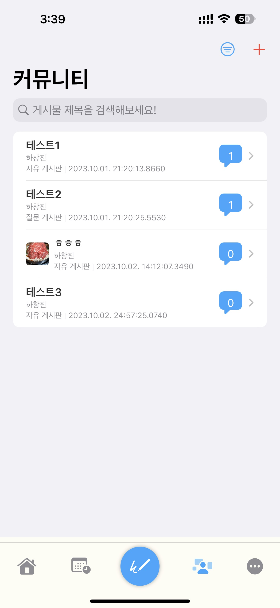

 
 
# DeepMind 
### Check your psychological status with ML, based on YOLOv8 
ⓒ 2023. Changjin Ha, [Yujee-Chang](https://github.com/yujeecatherine). All Rights Reserved.  

## Features 
#### Home 
> Check your latest inspection results, emotion statistics, health data and Latest informations at a glance. 

 

#### Daily Emotion 
> Once a day, record your emotion. 

 

#### Inspection 
> Draw House, Tree, Person with your Apple Pencil, or any inputs. 

    

> Get image detection, powered by YOLOv8x. 

 

> Check Essential Information for your image. 

 

> Check your inspection results in the blink of an eye  

 

> Share your inspection data as PDF.  

 

> Share your inspection data to Community.  

 

#### Consulting 
> The easiest way to contact a professional.  

 

> Book a consultation with just one touch.  

 

> Consult in a comfortable way between chat and door-to-door consultation.  

   

> Is the consultation over? Evaluate your experts and share them with others.  

  

#### Community 
> An easy way to communicate with people around the world  

  

> Talk to people through posts and comments.  

  

#### Grow-up Diary 
> Once a day, record your day with emotions. 

 

> Record your day with images, markups, and text.  

 

#### Statistics 
> Check your inspection results, emotion statistics history by date, with a chart. 

   

#### and so much more. 
> Change your information, delete your data on server, change your sensitive info, sign out, and secession  

  

## Compatibility 
> DeepMind is compatible with these devices.  
### iPhone 

> iPhone 15 Pro Max  
 iPhone 15 Pro  
 iPhone 15 Plus  
 iPhone 15  
 iPhone 14 Pro Max  
 iPhone 14 Pro  
 iPhone 14 Plus  
 iPhone 14  
 iPhone 13 Pro Max  
 iPhone 13 Pro  
 iPhone 13  
 iPhone 13 mini  
 iPhone 12 Pro Max  
 iPhone 12 Pro  
 iPhone 12  
 iPhone 12 mini  
 iPhone 11 Pro Max  
 iPhone 11 Pro  
 iPhone 11  
 iPhone Xs Max  
 iPhone Xs  
 iPhone XR  
 iPhone SE (3rd-Generation)  
 iPhone SE (2nd-Generation)  

### iPad 

> iPad Pro 12.9 (6th-Generation)  
 iPad Pro 11 (4th-Generation)  
 iPad Pro 12.9 (5th-Generation)  
 iPad Pro 11 (3rd-Generation)  
 iPad Pro 12.9 (4th-Generation)  
 iPad Pro 11 (2nd-Generation)  
 iPad Pro 12.9 (3rd-Generation)  
 iPad Pro 11 (1st-Generation)  
 iPad Pro 12.9 (2nd-Generation)  
 iPad Pro 10.5  
 iPad Air (5th-Generation)  
 iPad Air (4th-Generation)  
 iPad Air (3rd-Generation)  
 iPad mini (6th-Generation)  
 iPad mini (5th-Generation)  
 iPad (10th-Generation)  
 iPad (9th-Generation)  

 * Required iOS/iPadOS 17.0 or up.  
 * 1GB or higher storage required for install application.
